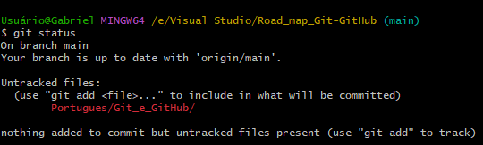
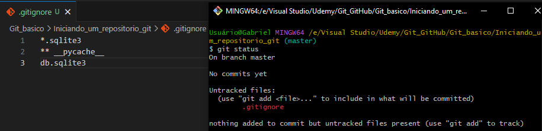

# GIT AND GITHUB

---

## Initializing a repository

To start a repository, use the `git init` command inside the directory you want.

---

## Project status

Use `git status` to view the state of the files within the repository.

---

## Git ignore

If you want to keep certain types of files or folders hidden from git, use a `.gitignore` file. If there are other files you want to ignore, just add their names to the `.gitignore` file.

---

## User identification

When committing a file, we need to identify ourselves to know who made each commit. For this, we use the commands `git config user.name "Name"` and `git config user.email "Email"`.

> - ### Configuring locally 
>   - `git config user.name "First Last"`
>   - `git config user.email "email@gmail.com"`
>
>   It is recommended to use this type of identification if the computer is used by more than one person.

> - ### Configuring globally
>   - `git config --global user.name "First Last"`
>   - `git config --global user.email "email@gmail.com"`
>
>   It is recommended to use this type of identification if the computer is used only by you.

---

## Git add

The `git add` command is used to notify git to start tracking a file.

> - ### Add files separately
>   - `git add (file name)`

> - ### Add all modified files
>   - `git add .`

---

