# GIT E GITHUB

---

## Inicializando um repositório

Para iniciar um repositório basta usar o comando `git init` dentro do diretório que deseja.

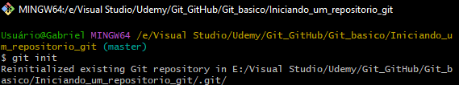

---

## Status do projeto

Utilize o `git status` para observar o estado dos arquivos que estão dentro do repositório.

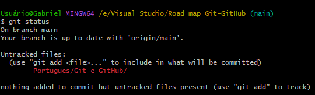

---

## Git ignore

Caso queira deixar algum tipo de arquivo ou repositório escondido do git utilize um arquivo `.gitignore`. Caso tenha outros arquivos que queira ignorar basta colocar o nome dos arquivos dentro do arquivo `.gitignore`.

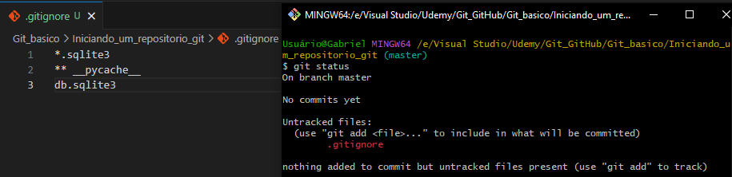

---

## Identificação de usuario

Quando vamos commitar uma arquivo, precisamos nos identificar para saber qual pessoa fez tal commit. Por isso usamos os comandos `git config user.name "Nome"` e `git config user.email "Email"`.

> - ### Configurando localmente 
>>`git config user.name "Nome Sobrenome"`
>>
>>`git config user.email "email@gmail.com"`
> 
>É recomendavel usar esse tipo de identificação caso o computador que você use seja utilizado por mais pessoas alem de você.

> - ### Configurando globalmente
>>`git config --global user.name "Nome Sobrenome"`
>>
>>`git config --global user.email "email@gmail.com"`
>
>É recomendavel usar esse tipo de identificação caso o computador que você use seja utilizado somente por você.

---

## Git add

O comando `git add` é usado para notificar o git que ele vai monitorar esse arquivo.

> - ### Adicionar arquivos separadamente
>> `git add (nome do arquivo)`
>
> - ### Adicionar todos os arquivos modificados
>> `git add .`

---

## Git commit

O `git commit` é usado para notificar que o arquivo foi salvo, nele você da uma breve explicação sobre oque foi modificado.

> `git commit -m "Commitando"`

---

## Git log

O `git log` é responsável por mostrar o histórico de commits feitos naquele repositório e os hashes (hash é o código de identificação do commit, que está destacado em amarelo)

> ### Filtragem de palavra

Caso eu queira fazer uma busca mais aprofundada nos logs do repositório, posso passar como parâmetro, após o `git log`, a palavra pela qual estou buscando.

`git log`
`/Atualização`

> ### Filtragem de logs

Caso eu queira filtrar uma quantidade especifíca de logs.

`git log -2`

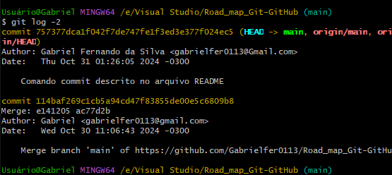

### Filtrando commit's logs

Utilize o comand `git log --oneline`

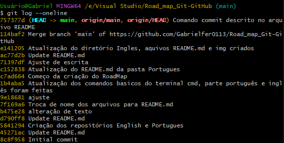

### FIltragem por data

Podemos filtrar a partir da data com os comandos a seguir:

>`git log --after='dd-mm-yyyy'`
>
>`git log --before='dd-mm-yyyy'`
>
>`git log --since='2 days ago'`
>
>`git log --after='3 mounths ago'`
>
>`git log --before='1 year ago'`
>
>`git log --author='autor'`

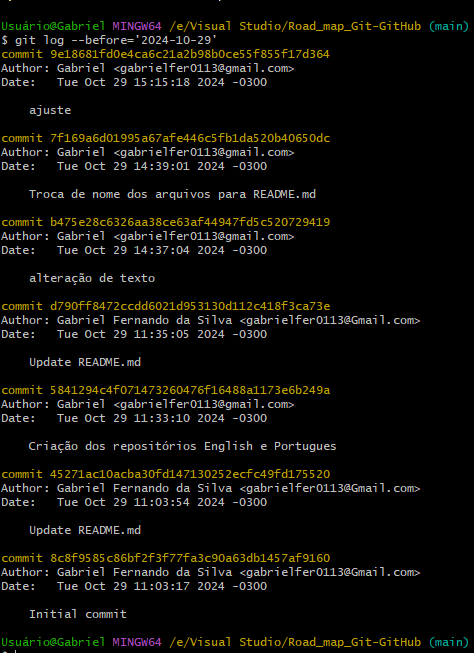

### Git help log

caso queira mais alguma ajuda use o comando `git help log`

---

## Git checkout (hash)

Caso queiramos voltar um commit que fizemos, poderemos usar o `git checkout (código da hash)`, isso vai fazer o seu arquivo voltar no tempo. Ele ira recuperar os dados daquela data do commit e descartando a nova.

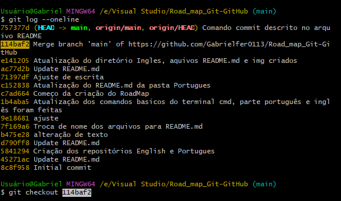

Para voltar para a main utilize `git checkout maste/main`

---

## Alteração de arquivos

para fazer a alteração do nome do arquivo basta usar o comando `git mv (nome do arquivo) (nome que deseja substituir)`

> ### Antes:
>>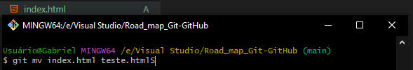
>
> ### Depois:
>>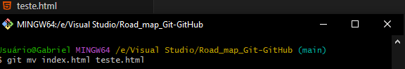

---

## Git remove

Para remover um arquivo utilize o comando `git rm (nome do arquivo/diretório)`

> ### Antes
>>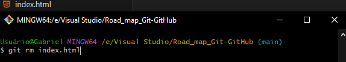
>
> ### Depois
>>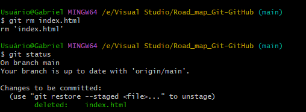

---

## Git diff

O `git diff` é usado para ver oque foi modificado no arquivo entre o ultimo commit e o mais atual, tambem podemos comparar a diferença com um commit antigo, ou seja, uma hash, ou comparar duas hash's diferentes

> ### Comparação com o commit atual
>>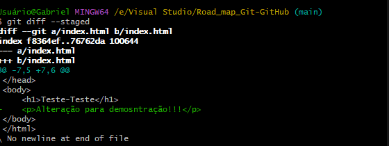
>
> ### Comparação com o commit atual com o uma hash antiga
>>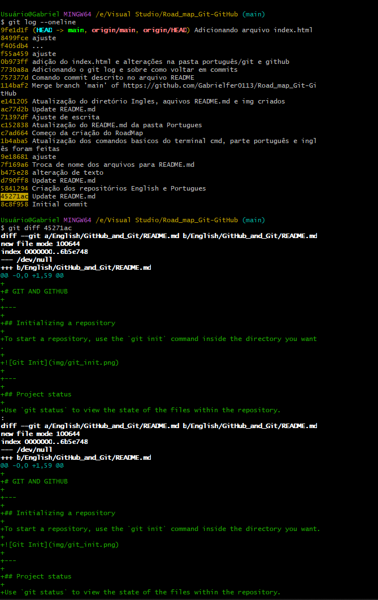
>
> ### Comparação de duas hash's diferentes
>>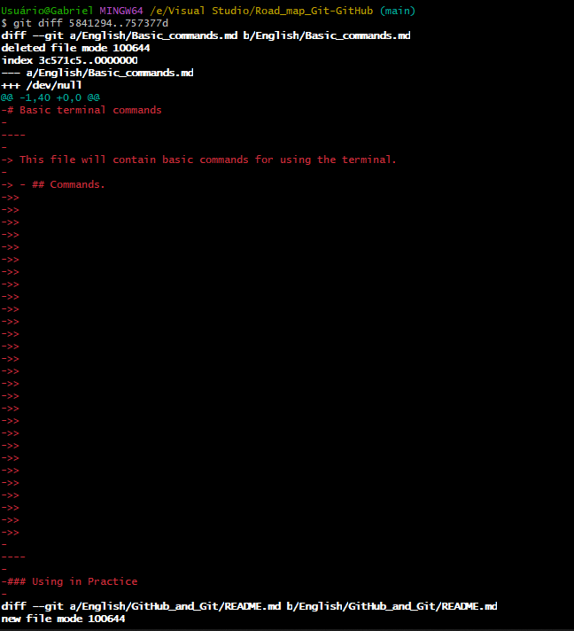

---

## Git --amend

O `git --amend` nos permite corrigir a mensagem de um commit caso ela não descreva corretamente a situação trabalhada.

> ### Commit com o descritivo errado 
>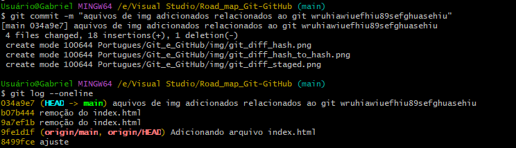
>
> ### Ajustando o commit 
>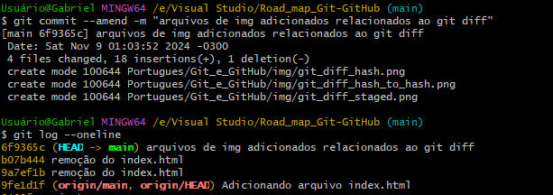

---

## Voltando ao ultimo commit

Caso façamos um commit que não foi muito bom para o main, podemos retornar o os arquivo para o ultimo commit com o comando `git reset HEAD^ --hard`

> ### Antes
>> 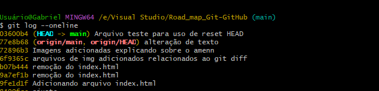
>
> ### Depois
>>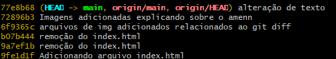

---

## Trabalhando com branches

Uma branch é uma ramificação do projeto principal, pense que o projeto principal é uma arvore e as "branches" são os galhos. A branch principal é chamado de "Master" ou "Main". Podemos usar o comando `git branch` para mostrar as branches existentes

>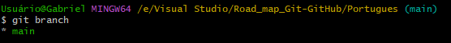

## Criando novas branches

Para criarmos uma nova branch basta usar o comando `git branch (nome_da_branch)`.

>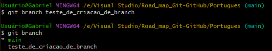

Ou podemos usar o comando `git checkout -b (nome_da_branch)` isso faria criar e mudar para a branch criada.

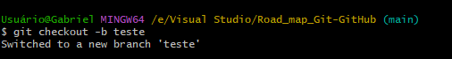

## Mudando de branch

Usando o comando `git checkout (nome_da_branch)` podemos alterar de branch.

>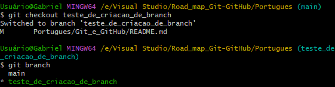

## Deletando uma branch

Para deletarmos uma branch basta usar o comando `git branch -D (nome_da_branch)`.

>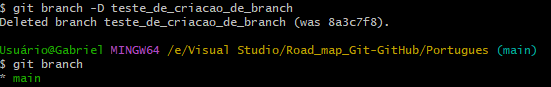

---

## Trabalhando com merge

Caso eu esteja trabalhando dentro de uma branch e eu vejo que eu posso mesclar ela com o a branch main eu poderia fazer o merge.

>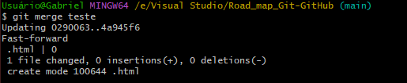
 
---

 

 ## Rebase

O `Rebase` diferente do merge ele mescla o código a partir de onde foi criado a branch, enquanto o merge mescla com a versão mais recente do código.

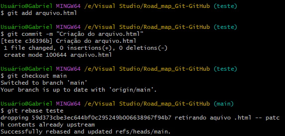

---

## Trabalhando com Clone 

Use o comando `git clone (nome do repositório git)` aí o git cria um clone do repositório.

---

## Trabalhando com Fetch e Pull

O `Fetch` baixa os arquivo e o `Rebase/Merge` reorganiza os commits, enquanto o `Pull` faz os dois ao mesmo tempo e verifica se há atualizações no código

>>
>
>Comandos para auxiliar o pull
>   ^ = Ctrl  

---

## Bare Repostory

Use o comando `Git init --bare`, isso vai fazer você puxar os arquivos da pasta .git, assim auxiliando melhor na hora de gerenciar o projeto. O Bare Repostory é o repositório principal onde ficara o projeto armazenado.

---

## Trabalhando com Tags

As `Tags` são usadas para disponibilizar uma versão estavel separada da main para que o usuario possa usar, essa versão pode ser uma versão incompleta.

Para criar uma `Tag` devemos escrever `git tag v1.0`. após isso devemos fazer um `push` para a origin (repositório remoto): `git push origin v1.0`. Isso fara que fique disponivel para todos que estão trabalhando no código.

Para mudar para o código dentro da versão use o comando `git checkou v1.0`, lembrando que não podemos alterar o código da v1.0 enquanto estivermos dentro da branch 1.0, só vamos poder visualizar. Caso essa versão necessite de uma atualização ou uma correção de bugs podemos criar uma branch dele usando o comando `git switch -c atulização_v1.0.1`, após de arrumar o bug ou criar a atulização basta fazer o `merge/rebase` e usar novamente o comando `git tag 1.0.1`.

Após todo esse processo devemos mandar a nova tag para o repositório remoto usando o comando `git push origin 1.0.1`

--- 

## GITHUB

No site do [GitHub](https://github.com/home) na hora de criação do site o nome do repositorio não pode haver acentuação ou espaçamento entre as palavra.
 Sempre criar um arquivo README para explicar como o projeto que será realizado naquele repositório.

>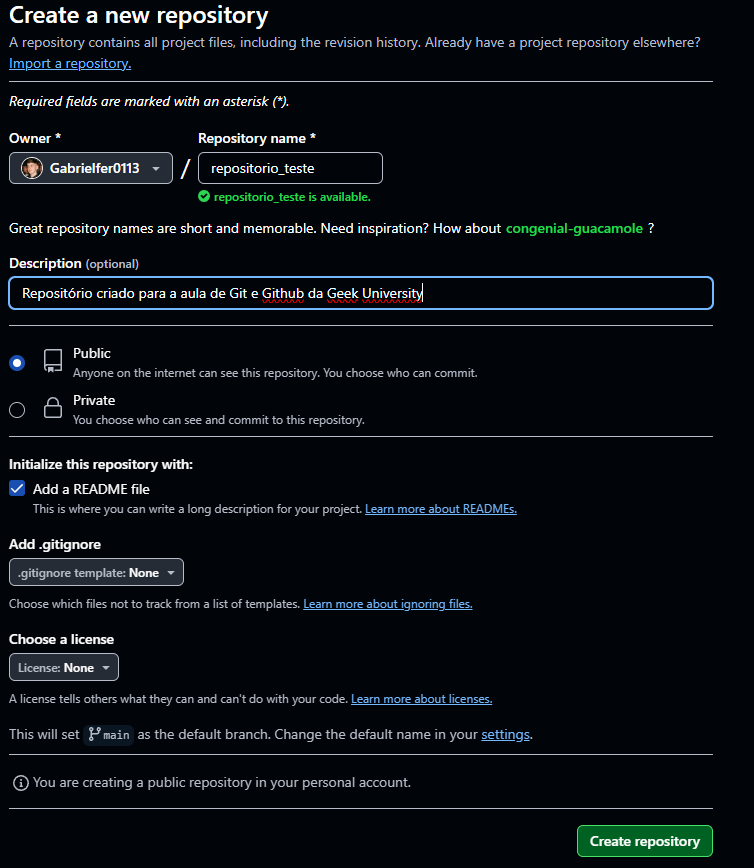

Uma coisa importante de se destacar é que, existem dois tipos de repositórios, privados e publicos, os privados são usados para impedir que outros usuarios não tenham acesso de vizualizar o projeto sendo feito,
enquanto o publico é possivel deixar visivel para todos e uma boa opção de mostrar a sua competencia nos seus projetos. 

>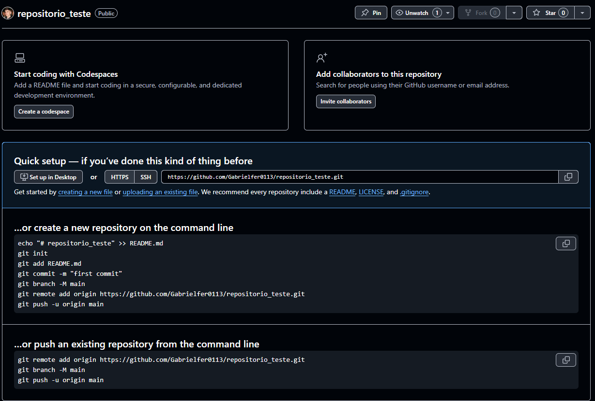

Após a criação do repositório o próprio [GitHub](https://github.com/home) nos mostra um tutorial para ajudar a usar o repositório.

>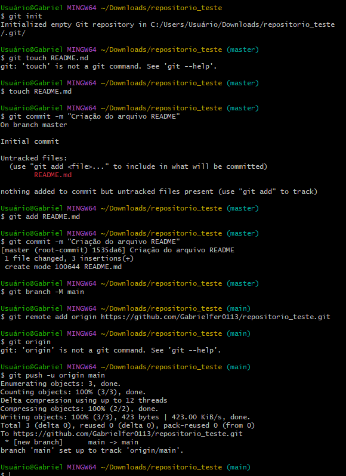

Seguindo os passo-a-passo descrito no site, podemos linkar o repositório local com o remoto.

Com o comando `git remote -v` podemos ver o endereço das origins.

>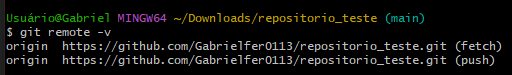

Após as alterções necessario faça o commit e de o push dessa maneira `git push -u origin main`

---

## Usando Clone e Pull

Para fazer o clone precisamos do https do repositorio que desejamos clone.

>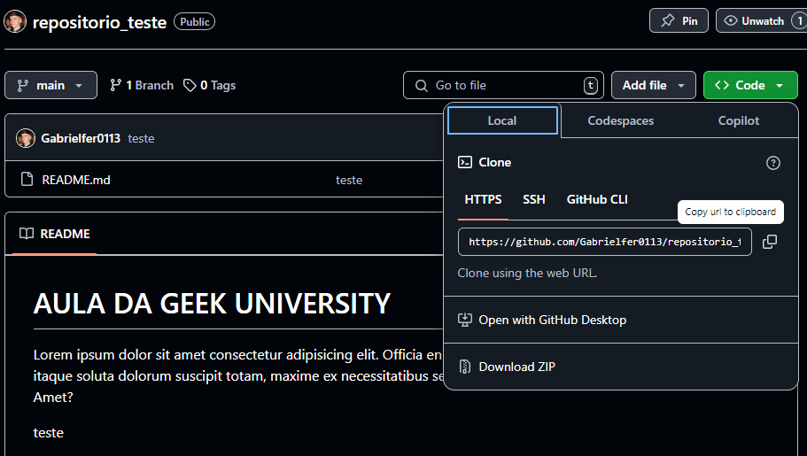

Após conseguir o https do repositório use o comando `git clone https/github.com/`.

>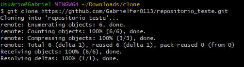

O `git pull` é usado para atualizar o seu código caso o remoto esteja atulizado e o seu não. Caso aconteça isso use o comando `git pull origin main`.

>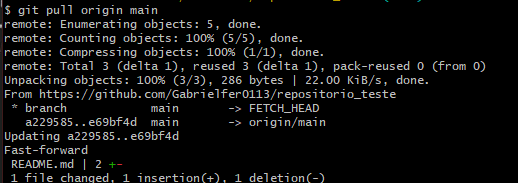

## Em produção...

